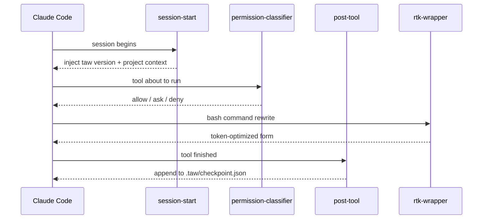

# taw-kit Architecture

Technical overview for developer-buyers who want to fork, extend, or audit the kit before deploying it internally. If you are a non-developer, start with the [quickstart](../quickstart.md) instead.

## Overview

taw-kit is a Claude Code extension that turns plain-language product descriptions (English or Vietnamese) into shipped web applications. It ships as a single installable bundle composed of:

- **34 skills** — scoped capability modules loaded on demand by Claude Code. The root orchestrator is `skills/taw/`; the rest cover stack concerns (Next.js scaffolding, Tailwind tokens, Supabase bootstrap, payment integration, deploy, error translation, etc.). One skill (`frontend-design`) is vendored from Anthropic under Apache 2.0; four Expo skills are vendored under MIT. See [THIRD-PARTY-NOTICES.md](../../THIRD-PARTY-NOTICES.md) for the full list.
- **6 agents** — specialist sub-agents dispatched by the orchestrator: `planner`, `researcher`, `fullstack-dev`, `mobile-dev`, `tester`, `reviewer`.
- **4 hooks** — lightweight lifecycle interceptors installed into Claude Code settings (`session-start`, `post-tool`, `permission-classifier`, `rtk-wrapper`).
- **`tawkit` CLI** — a small shell wrapper for install, update, doctor, uninstall, and offline maintenance tasks.
- **5 presets** — opinionated product blueprints (`landing-page`, `shop-online`, `crm`, `blog`, `dashboard`) with prefilled clarifying questions and stack defaults.

All user-visible output is simple English by default. Internal reasoning, logs, and state files are English too, to keep diffs readable for auditors. The `vietnamese-copy` and `error-to-vi` skills produce Vietnamese output on demand when the user asks for it.

## Orchestration Flow

The `/taw` skill runs an 8-step state machine. Each step has a single responsibility and writes a checkpoint to `.taw/` on disk so interrupted runs can resume.

```mermaid
flowchart TD
    U([User types /taw "..."])
    C1[Step 1: Classify intent]
    C2[Step 2: Clarify 3-5 questions]
    C3[Step 3: Render plan bullets]
    G{Step 4: Approval gate}
    A[Step 5: Spawn agent chain]
    R{Step 6: Error recovery}
    D[Step 7: Deploy handoff]
    F([Step 8: Return live URL])

    U --> C1 --> C2 --> C3 --> G
    G -- yes --> A
    G -- edit --> C2
    G -- cancel --> F
    A --> R
    R -- ok --> D
    R -- retry once --> A
    R -- fail --> F
    D -- success --> F
    D -- deploy fail --> F
```

The agent chain in Step 5 is strictly sequential, except for the `researcher` pair which runs in parallel (one Task message with two Task calls) to save wall-clock time. Each agent output is compacted to under 200 tokens before the next agent is dispatched — this keeps context usage bounded even for long projects.

## State Management

All runtime state lives in a gitignored `.taw/` directory at the project root. The orchestrator writes these files; humans read them when debugging.

| File | Purpose | Lifetime |
|------|---------|----------|
| `.taw/intent.json` | Classified intent, raw user text, clarification answers | Persists until `/taw` rerun |
| `.taw/plan.md` | Approved plan bullets (post-Step-4) | Persists across runs |
| `.taw/checkpoint.json` | `{last_step, last_error, status, next_action}` | Updated after every step |
| `.taw/deploy-target.txt` | Chosen deploy target (`vercel` / `docker` / `vps`) | Persists across runs |
| `.taw/deploy-url.txt` | Live URL after successful deploy | Updated per deploy |
| `.taw/vps.env` | VPS connection settings (only when target=vps) | User-maintained |
| `.taw/artifacts/*` | On-disk compaction buffers when context exceeds 150k tokens | Cleared per run |

Secrets never land in `.taw/`. The write path redacts any substring matching common token prefixes (`sk-`, `ghp_`, `SECRET`, `PASSWORD`) before flushing.

## Deploy Targets

`/taw-deploy` supports three targets. Pick one via `--target=` flag, preset override, or the interactive prompt on first deploy.

| Target | What it does | Who it's for |
|--------|--------------|--------------|
| **vercel** (default) | `npx vercel --prod` — zero-config cloud hosting on the Vercel free tier | Non-devs; fastest path to a live URL |
| **docker** | Generates `Dockerfile` + `.dockerignore`; builds a local image you can push anywhere | Users with Docker experience who want portability |
| **vps** | `rsync` + `ssh` to any Linux box; emits a systemd unit + nginx snippet | Users with their own VPS who want full control |

The chosen target is persisted to `.taw/deploy-target.txt` so subsequent `/taw-deploy` calls use the same path without re-prompting.

## Hook Architecture

Hooks extend Claude Code lifecycle events without modifying core behaviour. taw-kit registers four hooks in the user's `~/.claude/settings.json`:



- **`session-start`** — reads `VERSION` and injects a short banner so agents know which kit version is active.
- **`permission-classifier`** — classifies incoming tool calls by risk and short-circuits the permission prompt for known-safe reads.
- **`post-tool`** — listens for tool results, updates `.taw/checkpoint.json`, and triggers auto-retry logic for transient errors. Includes a debounce so rapid-fire edits produce one auto-commit, not ten.
- **`rtk-wrapper`** — optional. If the user has the `rtk` (Rust Token Killer) CLI installed, this hook rewrites common bash commands through `rtk` to cut token cost on large logs.

All four hooks are opt-in at install time. The `tawkit doctor` command verifies they are wired correctly.

## Extensibility Points

The kit is designed to be forked. Three extension surfaces:

**Custom presets.** Drop a new markdown file into `presets/` with the shape `{category, clarify_questions, stack_defaults, expected_phases, success_criteria}`. The orchestrator auto-discovers it and the user flow gets a new category with zero code changes.

**Stack overrides.** Every stack choice in `skills/taw/SKILL.md` ("Next.js 14 + Tailwind + Supabase + Polar, deploy to Vercel/Docker/VPS") is a default, not a mandate. If the user says "use Remix" or "skip Supabase" in Step 2, the orchestrator routes to the appropriate alternative skill. Add a new skill under `skills/<name>/` and reference it from a preset to make it discoverable.

**Agent replacement.** Each of the 6 agents is a single markdown file under `agents/`. Swap the prompt body to inject a different coding style, testing philosophy, or review checklist. The orchestrator only cares about the contract (input format + output format), not the internals.

## Security Model

taw-kit runs entirely client-side. There is no taw-kit server — nothing your Claude session produces leaves your machine except the API calls to Anthropic (for the LLM) and to whatever deploy target (Vercel, Supabase, Polar, your own Docker registry, or your own VPS) you explicitly authorize.

**Approval gate.** Step 4 is the single mandatory human checkpoint. No code is written, no accounts are created, no deploys are kicked off until the user types `yes`. This is a hard-coded contract; a rogue or drifted agent cannot bypass it.

**Reviewer P0 checks.** The `reviewer` agent runs fixed P0 (blocker) checks before handoff to deploy: (1) no plaintext secrets in committed files, (2) no hardcoded API keys in source, (3) `.env.local` is gitignored, (4) no SQL strings that concatenate user input, (5) no `dangerouslySetInnerHTML` of uncontrolled sources. A P0 failure halts the chain and surfaces an error to the user — there is no bypass flag.

**Secret scanning.** The auto-commit hook blocks commits containing `.env*`, `*.key`, `credentials.*`, or anything matching a common token prefix. This is belt-and-suspenders on top of the reviewer's check.

**Supply chain.** The orchestrator skills (`taw`, `taw-add`, `taw-fix`, `taw-deploy`, etc.) and all 6 agents are written from scratch for this product. Five skills are vendored from upstream open-source projects with their licenses preserved: `frontend-design` (Anthropic, Apache 2.0) and four Expo skills — `expo-tailwind-setup`, `expo-deployment`, `expo-dev-client`, `building-native-ui` (650 Industries / Expo, MIT). See [THIRD-PARTY-NOTICES.md](../../THIRD-PARTY-NOTICES.md) for full attribution and [decisions.md](../../plans/260421-0130-tawkit-orchestrator-kit/decisions.md) for the rationale.

## License

taw-kit is distributed under the terms in [LICENSE](../../LICENSE). Code generated by taw-kit belongs 100% to the buyer — the license does not reach into generated output. Redistribution of the kit itself (reselling, rebranding) requires a commercial license; contact the author.

## Further Reading

- User flow reference: [`skills/taw/SKILL.md`](../../skills/taw/SKILL.md)
- User docs: [`docs/quickstart.md`](../quickstart.md) and [`docs/troubleshooting.md`](../troubleshooting.md)
- Design decisions log: [`plans/260421-0130-tawkit-orchestrator-kit/decisions.md`](../../plans/260421-0130-tawkit-orchestrator-kit/decisions.md)
