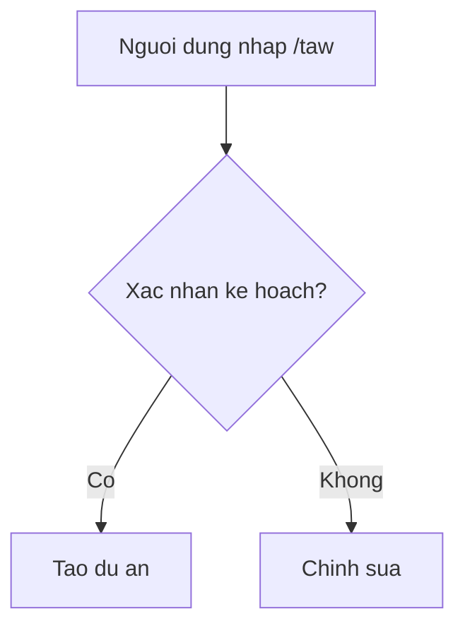
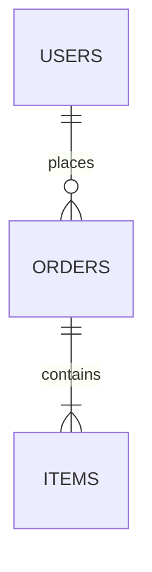
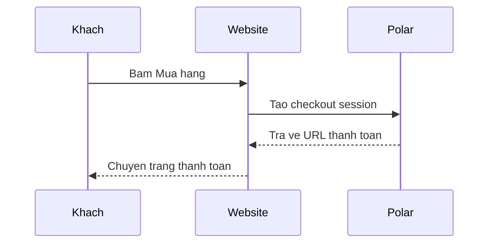
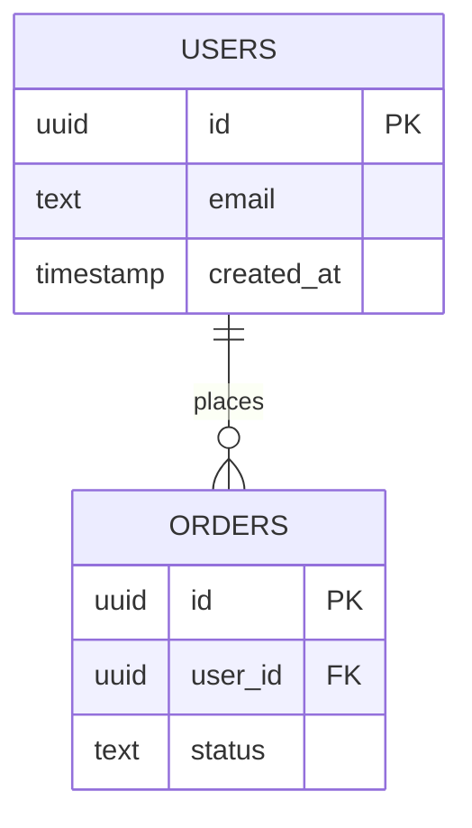

# mermaidjs-v11 — Diagram Generation

## Overview

Create text-based diagrams using Mermaid.js v11 declarative syntax.
Used in plan files and README docs to visualise flows for non-dev users.

## Common Diagram Types for taw-kit

- `flowchart` — user flows, feature decision trees
- `sequenceDiagram` — auth flows, payment webhook sequences
- `erDiagram` — Supabase table relationships
- `stateDiagram` — booking/order status machines

## Inline Markdown Usage

````markdown

````

## Configuration via Frontmatter

````markdown

````

## v11 Key Rules

- Use `flowchart` not `graph` (deprecated in v11)
- Node labels with spaces must be quoted: `A["Ten san pham"]`
- Subgraphs: `subgraph Title` ... `end`
- Comments: `%% nay la ghi chu`
- Arrow types: `-->` (normal), `-.->` (dashed), `==>` (thick)

## Sequence Diagram Example



## ER Diagram Example



## Rendering

- In GitHub/GitLab markdown: renders automatically in code blocks
- In plan files: use fenced code blocks with `mermaid` language tag
- CLI render: `npx @mermaid-js/mermaid-cli -i diagram.mmd -o diagram.svg`
